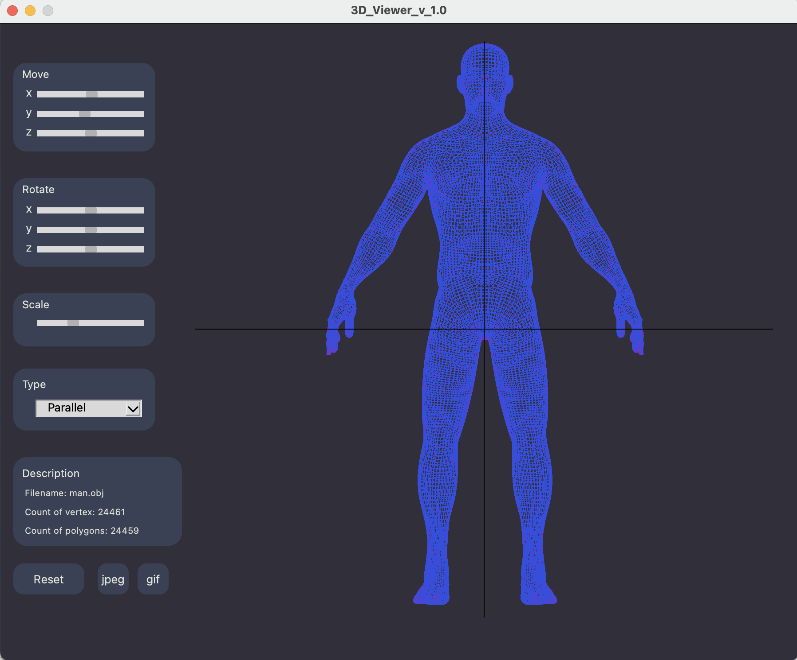
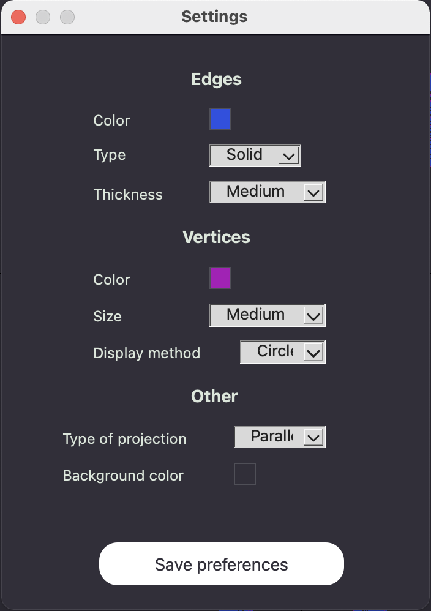
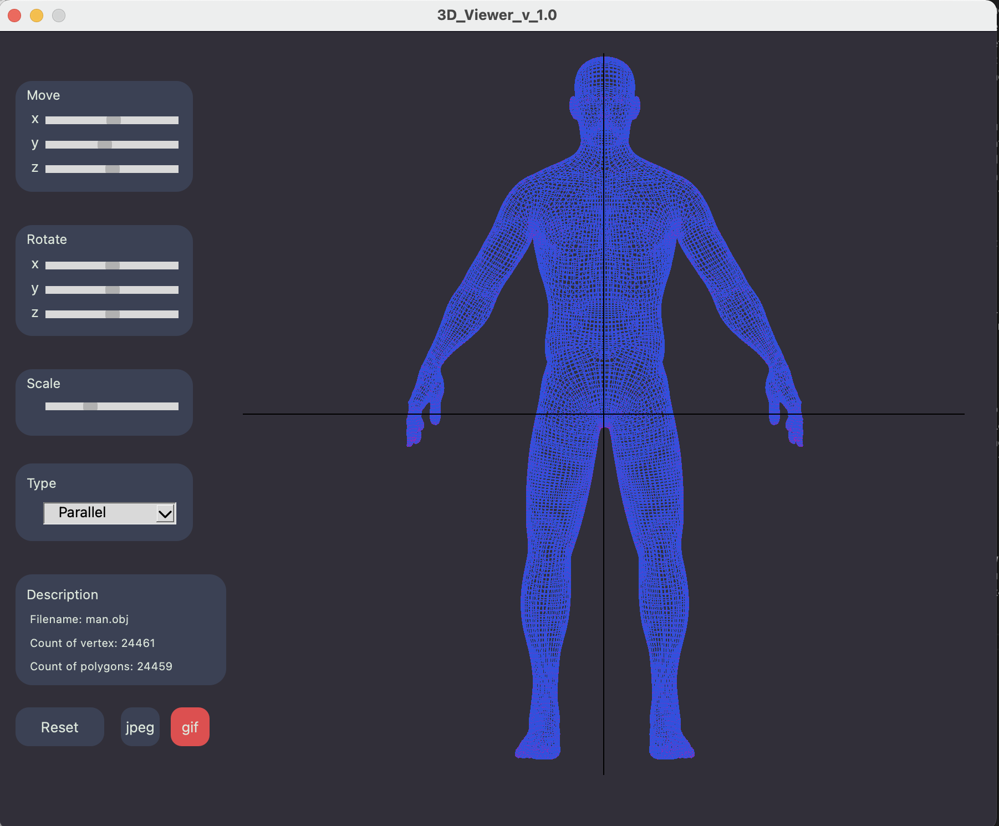

## Introduction
In this project, we implemented in the C programming language a program for viewing 3D models in a wireframe (3D Viewer) using a structural approach. Models are loaded from .obj files and it is possible to view them on the screen with the ability to rotate, scale and move. As additional enhancements, the program supports customization of projection types (parallel and central), line types (solid and dotted), edge color and thickness, display method (none, circle and square), vertex color and size, background color, and saving settings between restarts. , and save the resulting images to a file in bmp and jpeg formats and record small "screencasts" using a special button. The graphical user interface was implemented in a Qt.

## 3DViewer
The program provides an opportunity:
- Load wireframe from obj format file (only support list of vertices and surfaces).
- Move the model by a specified distance relative to the X, Y, Z axes.
- Rotate the model by a given angle relative to its X, Y, Z axes
- Scale the model by the given value.

The user interface contains:
- A button to select a file with a model and a field to display its name.
- Wireframe visualization zone.
- Sliders for moving the model.
- Sliders to rotate the model.
- Sliders for scaling the model.
- Information about the loaded model - file name, number of vertices and edges.

## Settings
The "Settings" dialog box supports:
Change projection types (parallel and central), line types (solid and dashed), edge color and thickness, display method (none, circle and square), vertex color and size and background color.
When the program is restarted, the settings are saved.

## Recording

The special "Record" mode allows you to save the received images to a file in bmp and jpeg formats, as well as record small "screencasts" using a special button - current custom affine transformations of the loaded object into gif-animation (640x480, 10fps, 5s).

